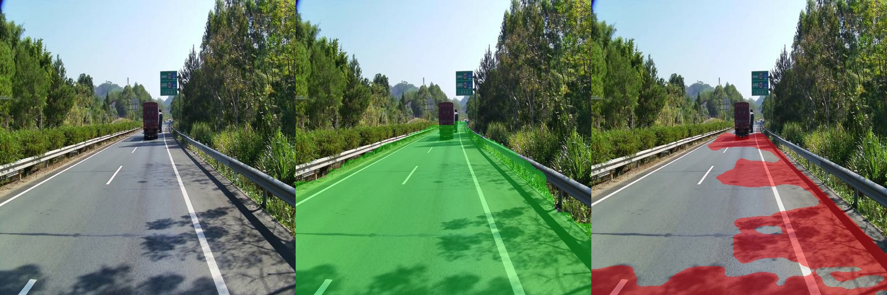
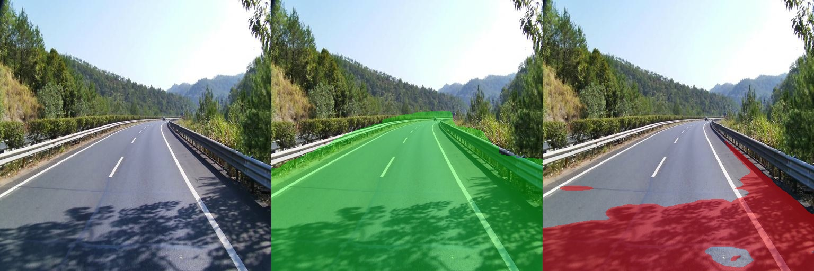
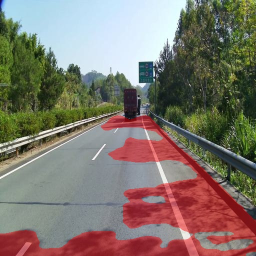
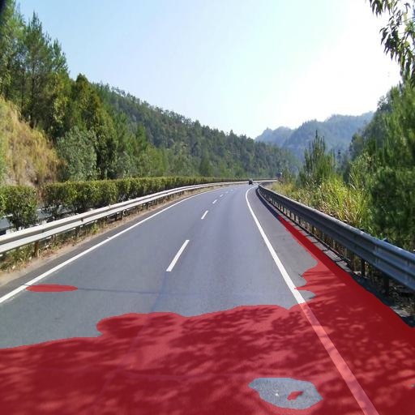
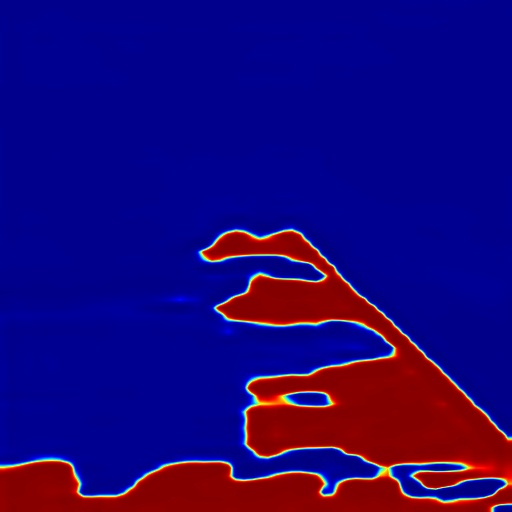
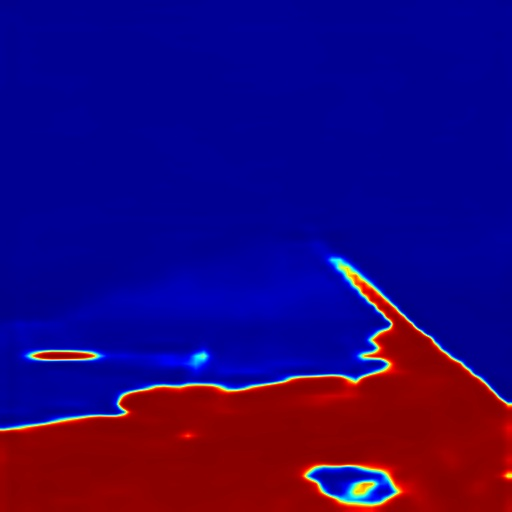

# Road Shadow Segmentation

本项目用于**车载前视道路图像中的道路影子分割**。

当前实现采用两阶段流程：

1. **道路区域分割**：使用现成的 SegFormer Cityscapes 语义分割模型提取道路区域。
2. **影子区域分割**：使用本地标注数据微调 DeepLabV3，预测道路上的 shadow mask。
3. **结果融合**：将影子预测结果与道路 mask 做约束，得到最终道路影子区域。

---

## 1. 当前效果概览

当前版本已经可以检测到大部分道路上的树影、护栏阴影和路侧植被投射阴影。

三联图可视化格式：




```text
左：原图
中：道路分割结果，绿色区域为 road mask
右：最终道路影子分割结果，红色区域为 shadow mask
```







当前效果评价：

| 模块 | 当前表现 |
|---|---|
| 道路分割 | 基本可用，主车道和阴影覆盖道路区域大多能覆盖 |
| 影子粗定位 | 可以定位大块影子和部分树影 |
| 像素级影子边界 | 仍需优化，存在过分割和块状预测问题 |
| 工程可用性 | 可作为第一版 baseline 和效果展示 |

当前主要问题：

- 部分暗路面会被误判为影子；
- 树影碎斑细节不够精细；
- 红色 shadow mask 有时会连成大块；
- 右侧路肩、护栏附近有一定误检；
- 小样本训练导致模型泛化能力有限。

---

## 2. 方法流程

整体流程如下：

```text
输入图像
  │
  ├── Road Segmentation
  │     使用 SegFormer Cityscapes 预训练模型
  │     输出 road_mask
  │
  ├── Shadow Segmentation
  │     使用本地标注数据训练 DeepLabV3
  │     输出 raw_shadow_mask
  │
  └── Mask Fusion
        refined_road_mask = close + dilate(road_mask)
        final_shadow_mask = raw_shadow_mask & refined_road_mask
```

最终输出：

```text
runs/predict_with_road/
  01_raw_shadow_masks/       原始影子预测，不加道路约束
  02_road_masks/             原始道路分割 mask
  03_road_masks_refined/     后处理后的道路 mask
  04_final_shadow_masks/     最终道路影子 mask
  05_shadow_heatmaps/        影子预测概率热力图
  06_road_overlays/          道路分割可视化
  07_final_overlays/         最终影子分割可视化
  08_compare/                三联图对比结果
```

---

## 3. 数据集结构

当前项目使用 60 张车载前视道路图作为第一版本地数据集。

推荐目录结构：

```text
dataset/
  images/
    1.jpg
    2.jpg
    ...
    60.jpg

  labels_json/
    1.json
    2.json
    ...
    60.json

  masks/
    1.png
    2.png
    ...
    60.png

  splits/
    train.txt
    val.txt
    test.txt

  scripts/
    00_check_dataset.py
    01_split.py
    02_labelme_to_mask.py
    03_train_deeplab.py
    05_predict_shadow_with_road.py

  runs/
    deeplab_shadow/
      best.pth
      last.pth

    predict_with_road/
      ...
```

---

## 4. 标注规范

使用 LabelMe 标注道路上的投射阴影。

标签名统一为：

```text
shadow
```

只标注：

- 树木投射到道路上的阴影；
- 车辆投射到道路上的阴影；
- 建筑物、护栏、标志牌、路灯杆等投射到道路上的阴影；
- 明显影响道路视觉判断的暗影区域。

不标注：

- 树木本身的暗部；
- 车辆本身的黑色区域；
- 建筑背光面；
- 绿化带暗部；
- 裂缝、井盖、车道线、沥青补丁；
- 路面材质本身变暗但不属于投射阴影的区域。

无明显道路影子的图片也需要保留，mask 应为空白。这类 hard negative 对减少误检很重要。

---

## 5. 环境安装

建议使用 Conda 环境：

```bash
conda create -n shadow-seg python=3.10 -y
conda activate shadow-seg
```

安装依赖：

```bash
pip install torch torchvision opencv-python pillow tqdm numpy scikit-learn
pip install labelme
pip install transformers accelerate safetensors huggingface_hub
```

如果使用 GPU，请确认 CUDA 可用：

```bash
python -c "import torch; print(torch.cuda.is_available())"
```

输出 `True` 表示可以使用 GPU。

---

## 6. LabelMe 标注与 mask 转换

启动 LabelMe：

```bash
labelme dataset/images --output dataset/labels_json --nodata
```

标注完成后，将 LabelMe 的 JSON 转为二值 mask：

```bash
python scripts/02_labelme_to_mask.py
```

输出：

```text
dataset/masks/
  1.png
  2.png
  ...
```

mask 规则：

```text
0   = 非影子
255 = 影子
```

---

## 7. 数据检查与划分

检查 image 和 mask 是否一一对应：

```bash
python scripts/00_check_dataset.py
```

划分训练、验证、测试集：

```bash
python scripts/01_split.py
```

默认划分：

```text
train: 40
val:   10
test:  10
```

---

## 8. 训练影子分割模型

当前 baseline 使用 DeepLabV3-ResNet50 做二分类影子分割。

训练：

```bash
python scripts/03_train_deeplab.py
```

显存不足时：

```bash
python scripts/03_train_deeplab.py --batch_size 2
```

训练完成后输出：

```text
runs/deeplab_shadow/
  best.pth
  last.pth
```

当前训练建议：

- 第一版可以先训练 60 epoch；
- 如果误检过多，降低 `pos_weight`；
- 如果漏检明显，可以适当降低预测阈值；
- 如果整片道路被误判为 shadow，需要增加无影子道路、暗路面非影子等 hard negative 样本。

---

## 9. 下载道路分割模型

道路分割使用现成模型：

```text
nvidia/segformer-b0-finetuned-cityscapes-1024-1024
```

如果可以直接访问 Hugging Face，脚本会自动下载。

如果网络不稳定，可以使用镜像手动下载：

```powershell
pip install -U huggingface_hub
$env:HF_ENDPOINT = "https://hf-mirror.com"
huggingface-cli download nvidia/segformer-b0-finetuned-cityscapes-1024-1024 --local-dir D:\models\segformer-b0-cityscapes
```

下载完成后，预测时指定本地路径：

```powershell
--road_model D:\models\segformer-b0-cityscapes
```

---

## 10. 预测与可视化

使用现成道路分割模型 + 本地影子分割模型进行预测：

```powershell
python scripts/05_predict_shadow_with_road.py ^
  --input_dir dataset/images ^
  --shadow_weight checkpoints/best.pth ^
  --output_dir runs/predict_with_road ^
  --road_model D:\models\segformer-b0-cityscapes
```

常用参数：

```text
--shadow_threshold   影子二值化阈值，默认 0.5
--road_close         道路 mask 闭运算核大小，默认 55
--road_dilate        道路 mask 膨胀核大小，默认 45
--road_labels        道路类别，默认 0；可设置 0 1 包含 sidewalk
```

示例：

```powershell
python scripts/05_predict_shadow_with_road.py ^
  --input_dir dataset/images ^
  --shadow_weight checkpoints/best.pth ^
  --output_dir runs/predict_with_road ^
  --road_model D:\models\segformer-b0-cityscapes ^
  --shadow_threshold 0.6 ^
  --road_dilate 30 ^
  --road_close 55
```

如果道路 mask 太窄，可以增大：

```powershell
--road_dilate 60
```

如果红色 shadow mask 太大，可以增大：

```powershell
--shadow_threshold 0.6
```

或：

```powershell
--shadow_threshold 0.7
```

---

## 11. 当前结论

```text
本地影子标注
  → DeepLabV3 训练
  → SegFormer 道路分割
  → 道路约束影子分割
  → 可视化结果输出
```

目前最有价值的部分：

- 已经形成完整流程；
- 道路分割模型可直接使用，无需自训练道路模型；
- 影子模型可以检测到大块道路阴影；
- 输出中间结果，便于继续定位问题。

当前主要瓶颈：

- 影子模型训练数据较少；
- DeepLabV3 对树影碎斑和半影边界不够精细；
- 对暗路面、光照渐变、右侧路肩暗区存在误检；
- 需要补充 hard negative 样本和更多真实树影样本。

---

## 12. 下一步优化计划

优先级从高到低：

### 1. 参数调优

尝试不同组合：

```text
shadow_threshold: 0.5 / 0.6 / 0.7
road_dilate:      15 / 30 / 45 / 60
road_close:       35 / 55 / 75
```

### 2. 补充 hard negative 数据

重点补充：

- 无明显影子的正常道路；
- 整体偏暗但不是影子的道路；
- 山路、树林多但道路无明显投射影子的场景；
- 路肩、护栏、车道线、裂缝、井盖等容易误判的样本。

### 3. 重新训练 shadow 模型

建议降低正样本权重，避免过分割：

```python
weight = float(np.clip(weight, 1.0, 3.0))
```

或：

```python
weight = float(np.clip(weight, 1.0, 4.0))
```

### 4. 替换影子分割 backbone

后续可以尝试：

- SegFormer-B0 / SegFormer-B1 做 shadow segmentation；
- U-Net++；
- DeepLabV3+；
- SAM / SAM2 作为后处理细化模块。

---
